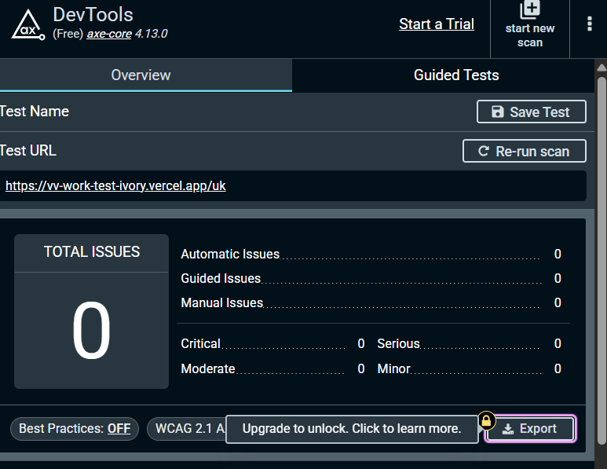

# VV Work

VV Work --- платформа для пошуку роботи та працівників у Європі.

Проєкт розробляється як тестове завдання з акцентом на компонентну
архітектуру, продуктивність, доступність, типізацію та зрозумілу
структуру коду.

---

## Demo

Production: https://vv-work-test-ivory.vercel.app

---

## Tech Stack

- Vite
- React
- TypeScript
- Tailwind CSS
- React Router
- i18next
- react-i18next
- Lucide React
- Vitest
- Testing Library

Без сторонніх UI-кітів та глобальних state-management бібліотек на
кшталт Redux або Zustand.

---

## Getting Started

### Requirements

Для локального запуску потрібні:

- Node.js 20+
- npm

### Clone repository

```bash
git clone <repository-url>
cd vv-work
```

### Install dependencies

```bash
npm install
```

### Start development server

```bash
npm run dev
```

Після запуску застосунок буде доступний локально через Vite dev server.

### Production build

```bash
npm run build
```

### Preview production build

```bash
npm run preview
```

### Run tests

```bash
npm run test
```

### Run tests with coverage

```bash
npm run test:coverage
```

---

## Project Structure

```text
src/
├── app/
│   └── router.tsx
│
├── assets/
│   ├── fonts/
│   └── images/
│
├── components/
│   ├── Footer/
│   ├── Header/
│   ├── home/
│   ├── layout/
│   └── ui/
│
├── data/
│   ├── categories.ts
│   ├── jobs.ts
│   └── partners.ts
│
├── hooks/
│   ├── useDebounce.ts
│   └── useDebounce.test.ts
│
├── i18n/
│   ├── translations/
│   │   ├── en.json
│   │   └── uk.json
│   ├── config.ts
│   └── index.ts
│
├── pages/
│   └── legal/
│       └── LegalPage/
│           ├── index.ts
│           └── LegalPage.tsx
│
├── seo/
│   ├── index.ts
│   ├── PageMeta.tsx
│   └── PageMeta.types.ts
│
├── services/
│   ├── jobsApi.ts
│   ├── jobsApi.test.ts
│   ├── mockFetch.ts
│   ├── mockFetch.test.ts
│   ├── partnersApi.ts
│   └── partnersApi.test.ts
│
├── tests/
│
├── types/
│   ├── common.ts
│   ├── job.ts
│   └── partner.ts
│
├── utils/
│   ├── validation.ts
│   └── validation.test.ts
│
└── main.tsx
```

---

## Architecture

Проєкт побудований за компонентним підходом із розділенням
відповідальності між UI, сторінками, даними, сервісами, типами та
допоміжною логікою.

### Components

Повторно використовувані компоненти знаходяться в:

```text
src/components
```

Компоненти розділені за областями відповідальності.

Наприклад:

```text
components/
├── Header/
├── Footer/
├── home/
├── layout/
└── ui/
```

У `ui` знаходяться універсальні компоненти, які можуть використовуватися
в різних частинах застосунку.

Наприклад:

- Button
- ErrorState
- LanguageSwitcher
- PageLoader
- Skeleton
- ThemeToggle
- Toast

Компоненти UI не повинні напряму залежати від mock-даних або API layer.

### Legal pages

Юридичні сторінки (Privacy Policy, Cookie Policy, Terms) винесені в
окремий модуль:

```text
src/pages/legal/LegalPage
```

Це дозволяє повторно використовувати одну сторінку-шаблон для всіх
legal-документів, підставляючи лише відповідний контент.

### SEO

Логіка керування метаданими сторінки (title, description, canonical,
robots) винесена в окремий модуль:

```text
src/seo
├── index.ts
├── PageMeta.tsx
└── PageMeta.types.ts
```

Компонент `PageMeta` підключається на рівні сторінок і відповідає за
коректні meta-теги для кожної локалізованої версії маршруту.

---

## Pages

Сторінки знаходяться в:

```text
src/pages
```

Page-компоненти відповідають переважно за композицію сторінки та
підключення необхідних секцій.

Бізнес-логіка, яку можна винести окремо, не повинна зберігатися
безпосередньо у великих page-компонентах.

---

## Routing

Для маршрутизації використовується React Router.

Основна конфігурація знаходиться в:

```text
src/app/router.tsx
```

Застосунок використовує language-prefixed routes.

Приклади:

```text
/uk
/en
/uk/contacts
/en/contacts
/uk/partners/:slug
/en/partners/:slug
/uk/privacy-policy
/en/privacy-policy
/uk/cookie-policy
/en/cookie-policy
/uk/terms
/en/terms
```

Сторінки завантажуються через React `lazy`, що дозволяє виконувати
route-level code splitting та не завантажувати JavaScript усіх сторінок
під час першого відкриття застосунку.

Header та Footer використовуються як спільні layout-компоненти.

Для production deployment SPA routing налаштований таким чином, щоб
пряме відкриття вкладених маршрутів не повертало серверний `404`.

---

## Localization

Для локалізації використовуються:

- i18next
- react-i18next

Переклади знаходяться в:

```text
src/i18n/translations/
├── uk.json
└── en.json
```

На даний момент підтримуються:

```text
uk — українська
en — англійська
```

Мова також є частиною URL:

```text
/uk
/en
```

Це дозволяє відкривати та поширювати посилання на конкретну мовну версію
сторінки.

Архітектура локалізації побудована так, щоб у майбутньому можна було
додавати нові мови без переписування основної логіки застосунку.

---

## Theme

Застосунок підтримує:

- Dark theme
- Light theme

Поточна тема застосовується через атрибут:

```html
data-theme="dark"
```

або:

```html
data-theme="light"
```

Основні кольори, backgrounds, borders, shadows та інші design tokens
визначені через CSS Custom Properties.

Наприклад:

```css
--color-primary
--color-bg
--color-surface
--color-card
--color-text-primary
--color-text-secondary
--color-border
```

Це дозволяє змінювати тему без дублювання стилів у React-компонентах.

Hero та елементи Header, які знаходяться поверх темного фонового
зображення, використовують постійні контрастні кольори незалежно від
глобальної теми.

---

## Fonts

Основний шрифт застосунку:

```text
Manrope
```

Шрифти зберігаються локально:

```text
src/assets/fonts/
```

Використовуються локальні `woff2` файли, що дозволяє уникнути додаткових
запитів до зовнішніх font providers.

---

## Data

Mock-дані знаходяться в:

```text
src/data
```

На даний момент структура передбачає:

```text
categories.ts
jobs.ts
partners.ts
```

Domain models для цих даних винесені окремо в:

```text
src/types
```

---

## API Simulation

Оскільки застосунок не використовує реальний backend, робота API
імітується через service layer.

Сервіси знаходяться в:

```text
src/services
```

Наприклад:

```text
mockFetch.ts
jobsApi.ts
partnersApi.ts
```

`mockFetch` імітує поведінку реального HTTP API.

Він може додавати:

- асинхронну затримку відповіді;
- успішну відповідь;
- випадкову помилку;
- можливість перевірити error state;
- можливість перевірити retry logic.

UI не повинен напряму імпортувати mock data там, де використовується API
simulation.

Замість цього використовується:

```text
UI
 ↓
Service
 ↓
mockFetch
 ↓
Mock Data
```

Такий підхід дозволяє в майбутньому замінити mock layer реальним backend
API без значного переписування UI.

---

## Vacancy Search

Пошук вакансій передбачає:

- пошук за текстовим запитом;
- фільтрацію вакансій;
- категорії;
- debounce;
- асинхронне отримання даних;
- loading state;
- error state;
- retry.

Для debounce використовується власний React hook:

```text
src/hooks/useDebounce.ts
```

Це дозволяє не виконувати пошук після кожного введеного символу.

Пошук виконується після невеликої паузи після введення користувачем
тексту.

---

## TypeScript

Проєкт використовує TypeScript із суворою типізацією.

Основні domain types винесені в:

```text
src/types
```

Наприклад:

```text
common.ts
job.ts
partner.ts
```

У production-коді уникається використання:

```ts
any;
```

Типи компонентів, API responses, domain models та props описуються явно.

---

## Testing

Для unit/integration тестування використовуються Vitest, Testing Library
та jsdom.

Тести розміщені поруч із логікою, яку вони перевіряють. Основний фокус
--- не presentation markup, а поведінка застосунку:

- `useDebounce` --- затримка оновлення значення, cleanup таймера та
  зміна delay;
- `usePartnerPage` --- пошук, категорії та одночасна робота фільтрів;
- `JobSearch` --- запуск пошуку, режими job/employee, error state та
  retry після невдалого запиту;
- `ContactForm` --- required/min/max validation, формат
  телефону/Telegram, success/error submit flow;
- `mockFetch` --- випадкова затримка та помилка;
- service layer --- jobs, candidates, partners та contact API.

Ключові вимоги тестового завдання покриті окремими тестами:

```text
debounce search  ✓
form validation  ✓
retry logic      ✓
```

Запуск усіх тестів:

```bash
npm run test:run
```

Запуск coverage:

```bash
npm run test:coverage
```

---

## Test Coverage

Coverage запускається командою:

```bash
npm run test:coverage
```

Мінімальна ціль:

```text
60%+ coverage application logic
```

Основний фокус покриття --- логіка застосунку, а не прості presentation
components.

Особлива увага приділяється:

```text
debounce
validation
API layer
error handling
retry logic
filtering/search logic
```

---

## Accessibility

У застосунку враховані базові accessibility-вимоги:

- semantic HTML;
- keyboard navigation;
- focus-visible states;
- Skip to content;
- доступні button controls;
- `aria-label`, `aria-expanded`, `aria-selected`;
- коректні label для form controls;
- доступні inline-повідомлення про помилки;
- достатній color contrast.

Фінальна автоматична перевірка виконана через axe DevTools на production
deployment.



Результат:

```text
Total issues: 0
Critical: 0
Serious: 0
Moderate: 0
Minor: 0
```

Таким чином, вимога тестового завдання щодо відсутності critical/serious
axe-помилок виконана.

---

## Performance

Одна з вимог проєкту:

```text
Lighthouse Performance >= 90
```

Для оптимізації використовуються:

- route-level lazy loading;
- code splitting;
- WebP images;
- local WOFF2 fonts;
- мінімальна кількість сторонніх dependencies;
- відсутність важкого UI framework;
- lightweight Lucide SVG icons;
- оптимізація великих background images;
- memoization там, де вона має практичну користь.

Lighthouse потрібно запускати для production build, а не Vite
development server.

```bash
npm run build
npm run preview
```

Після цього перевіряється Home Page через Chrome Lighthouse.

---

## Lighthouse

Фінальна перевірка виконана на production deployment у Vercel для Home
Page.


Фінальні результати:

```text
Performance: 99
Accessibility: 100
Best Practices: 96
SEO: 100
```

Вимога тестового завдання `Lighthouse Performance >= 90` виконана.

---

## Key Technical Decisions

### Language in URL

Мова зберігається безпосередньо в URL:

```text
/uk
/en
```

замість використання лише `localStorage`.

Це дозволяє:

- відкривати конкретну локалізовану сторінку;
- поширювати localized links;
- зберігати мову після refresh;
- масштабувати routing на нові мови.

### API abstraction instead of direct mock imports

UI не повинен напряму працювати з:

```text
data/jobs.ts
data/partners.ts
```

Для цього використовується service layer.

```text
Component
    ↓
Service
    ↓
Mock API
    ↓
Data
```

Завдяки цьому mock API у майбутньому можна замінити справжнім HTTP API
без значних змін у компонентах.

### No global state library

Redux або Zustand не використовуються.

Для поточного масштабу застосунку достатньо:

- React local state;
- URL state;
- React Router;
- i18next.

Додавання окремого global state manager на цьому етапі створило б зайву
складність.

### Reusable UI components

Повторювані елементи винесені в reusable components.

Наприклад:

```text
Button
ErrorState
LanguageSwitcher
PageLoader
Skeleton
ThemeToggle
Toast
```

Це дозволяє:

- уникати дублювання;
- підтримувати єдиний дизайн;
- спрощувати майбутні зміни UI;
- тримати page components компактними.

### Hero independent from global theme

Hero використовує темне фонове зображення.

Через це основний текст Hero та Header поверх Hero залишається світлим
навіть при активній light theme.

Інакше глобальні light-theme tokens могли б зробити текст недостатньо
контрастним відносно background image.

---

## Мої рішення

1. **Головна сторінка побудована навколо двох сценаріїв --- пошуку
   роботи та пошуку працівників.** Hero одразу пояснює цінність VV
   Work, а пошук і популярні категорії знаходяться у першому екрані,
   щоб скоротити шлях користувача до релевантного результату.

2. **Для стану використано локальний React state та спеціалізовані
   hooks замість Redux/Zustand.** Поточний масштаб не потребує
   глобального store: пошукові фільтри, UI-стани та дані мають локальну
   область відповідальності. Це зменшує кількість залежностей і спрощує
   підтримку.

3. **Пошук і фільтрація винесені в окрему логіку.** Ручний
   `useDebounce` не запускає пошук після кожного символу, а `useMemo` у
   Partner Page обчислює partner jobs, доступні категорії та
   відфільтрований список лише при зміні відповідних залежностей. Пошук
   і category filter працюють одночасно.

4. **Mock API відділений від UI через service layer.** Компоненти
   працюють із `jobsApi`, `partnersApi`, `candidatesApi` та
   `contactApi`, а затримка й випадкові помилки централізовані в
   `mockFetch`. Це дозволяє надалі замінити mock backend реальним API
   без переписування UI.

5. **Доступність і продуктивність перевірялися як частина реалізації, а
   не лише наприкінці.** Додані semantic markup, keyboard/focus states,
   Skip to content, доступні form errors, contrast fixes, lazy-loaded
   routes, локальні WOFF2-шрифти та WebP-зображення. Фінальний
   результат: Lighthouse Performance 99 та axe без accessibility
   issues.

---

## Відхилення та розширення брифу

Базові вимоги брифу збережені, але MVP свідомо розширено в кількох
місцях:

- **Локалізація UK/EN і language-prefixed routes.** Замість однієї
  мовної версії використані `/uk` та `/en`, щоб архітектура була
  готова до європейського продукту та дозволяла поширювати прямі
  локалізовані посилання.
- **Dark / Light theme.** Тема не була обов'язковою вимогою, але
  додана як невелике UX-покращення. Design tokens винесені в CSS
  Custom Properties, тому тема не дублює стилі компонентів.
- **Legal pages і cookie banner.** Додані Privacy Policy, Cookie
  Policy та Terms, оскільки вони природно доповнюють footer і роблять
  MVP ближчим до реального продукту.
- **Пошук кандидатів на Home.** Окрім сценарію вакансій, Hero
  підтримує напрям «Знайти працівника», щоб обидві основні аудиторії
  VV Work мали зрозумілу точку входу.
- **SEO та SPA deployment support.** Додані page metadata,
  canonical/robots/sitemap та Vercel SPA fallback для коректного
  прямого відкриття локалізованих і динамічних маршрутів.

---

## Deployment

Production deployment виконується через Vercel.

Оскільки застосунок використовує client-side routing, production hosting
налаштований для SPA fallback.

Це дозволяє напряму відкривати маршрути на кшталт:

```text
/uk
/en
/uk/contacts
/en/partners/example
```

без server-side `404`.

---

## Current Status

MVP для тестового завдання завершений та задеплоєний.

Реалізовано:

- Home Page з Hero, пошуком, популярними категоріями, блоком партнерів
  і CTA для роботодавців;
- динамічну Partner Page `/partners/:slug`;
- Contacts Page з клієнтською валідацією та optimistic submit flow;
- shared Header / Footer;
- responsive layout для desktop, tablet і mobile;
- українську та англійську локалізацію;
- dark / light theme;
- mock API із затримкою 300--800 ms та випадковою помилкою;
- skeleton/loading, error та retry states;
- route-level lazy loading;
- legal pages, cookie banner та базові SEO/meta налаштування;
- unit/integration tests для ключової логіки;
- production deployment через Vercel;
- Lighthouse Performance 99;
- axe audit: 0 critical / 0 serious issues.

---

## Final Quality Check

```text
TypeScript strict mode                         ✓
No any in application code                     ✓
Component-based architecture                   ✓
React Router + shared Header / Footer          ✓
Manual debounce                                ✓
Combined vacancy search + category filtering   ✓
Mock API delay/error simulation                ✓
Skeleton / error / retry states                ✓
Contact form validation                        ✓
Optimistic contact submit                      ✓
Tests: debounce / validation / retry           ✓
>= 60% logic coverage                          ✓
Lighthouse Performance >= 90                   ✓  (99)
axe critical/serious issues                    ✓  (0 / 0)
Vercel production deployment                   ✓
```

---

## Author

Liubov Pohudina
