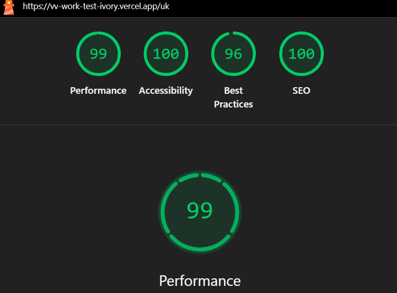

# VV Work

VV Work — платформа для пошуку роботи та працівників у Європі.

Проєкт розробляється як тестове завдання з акцентом на компонентну архітектуру, продуктивність, доступність, типізацію та зрозумілу структуру коду.

---

## Demo

Production:

```text
https://vv-work-test-ivory.vercel.app
```

---

## Tech Stack

- Vite
- React
- TypeScript
- Tailwind CSS
- React Router
- i18next
- react-i18next
- Lucide React
- Vitest
- Testing Library

Без сторонніх UI-кітів та глобальних state-management бібліотек на кшталт Redux або Zustand.

---

## Getting Started

### Requirements

Для локального запуску потрібні:

- Node.js 20+
- npm

### Clone repository

```bash
git clone <repository-url>
cd vv-work
```

### Install dependencies

```bash
npm install
```

### Start development server

```bash
npm run dev
```

Після запуску застосунок буде доступний локально через Vite dev server.

### Production build

```bash
npm run build
```

### Preview production build

```bash
npm run preview
```

### Run tests

```bash
npm run test
```

### Run tests with coverage

```bash
npm run test:coverage
```

---

## Project Structure

```text
src/
├── app/
│   └── router.tsx
│
├── assets/
│   ├── fonts/
│   └── images/
│
├── components/
│   ├── Footer/
│   ├── Header/
│   ├── home/
│   ├── layout/
│   └── ui/
│
├── data/
│   ├── categories.ts
│   ├── jobs.ts
│   └── partners.ts
│
├── hooks/
│   ├── useDebounce.ts
│   └── useDebounce.test.ts
│
├── i18n/
│   ├── translations/
│   │   ├── en.json
│   │   └── uk.json
│   ├── config.ts
│   └── index.ts
│
├── pages/
│
├── services/
│   ├── jobsApi.ts
│   ├── jobsApi.test.ts
│   ├── mockFetch.ts
│   ├── mockFetch.test.ts
│   ├── partnersApi.ts
│   └── partnersApi.test.ts
│
├── tests/
│
├── types/
│   ├── common.ts
│   ├── job.ts
│   └── partner.ts
│
├── utils/
│   ├── validation.ts
│   └── validation.test.ts
│
└── main.tsx
```

---

## Architecture

Проєкт побудований за компонентним підходом із розділенням відповідальності між UI, сторінками, даними, сервісами, типами та допоміжною логікою.

### Components

Повторно використовувані компоненти знаходяться в:

```text
src/components
```

Компоненти розділені за областями відповідальності.

Наприклад:

```text
components/
├── Header/
├── Footer/
├── home/
├── layout/
└── ui/
```

У `ui` знаходяться універсальні компоненти, які можуть використовуватися в різних частинах застосунку.

Наприклад:

- Button
- ThemeToggle
- LanguageSwitcher
- PageLoader
- notifications

Компоненти UI не повинні напряму залежати від mock-даних або API layer.

---

## Pages

Сторінки знаходяться в:

```text
src/pages
```

Page-компоненти відповідають переважно за композицію сторінки та підключення необхідних секцій.

Бізнес-логіка, яку можна винести окремо, не повинна зберігатися безпосередньо у великих page-компонентах.

---

## Routing

Для маршрутизації використовується React Router.

Основна конфігурація знаходиться в:

```text
src/app/router.tsx
```

Застосунок використовує language-prefixed routes.

Приклади:

```text
/uk
/en

/uk/contacts
/en/contacts

/uk/partners/:slug
/en/partners/:slug

/uk/privacy-policy
/en/privacy-policy

/uk/cookie-policy
/en/cookie-policy

/uk/terms
/en/terms
```

Сторінки завантажуються через React `lazy`, що дозволяє виконувати route-level code splitting та не завантажувати JavaScript усіх сторінок під час першого відкриття застосунку.

Header та Footer використовуються як спільні layout-компоненти.

Для production deployment SPA routing налаштований таким чином, щоб пряме відкриття вкладених маршрутів не повертало серверний `404`.

---

## Localization

Для локалізації використовуються:

- i18next
- react-i18next

Переклади знаходяться в:

```text
src/i18n/translations/
├── uk.json
└── en.json
```

На даний момент підтримуються:

```text
uk — українська
en — англійська
```

Мова також є частиною URL:

```text
/uk
/en
```

Це дозволяє відкривати та поширювати посилання на конкретну мовну версію сторінки.

Архітектура локалізації побудована так, щоб у майбутньому можна було додавати нові мови без переписування основної логіки застосунку.

---

## Theme

Застосунок підтримує:

- Dark theme
- Light theme

Поточна тема застосовується через атрибут:

```html
data-theme="dark"
```

або:

```html
data-theme="light"
```

Основні кольори, backgrounds, borders, shadows та інші design tokens визначені через CSS Custom Properties.

Наприклад:

```css
--color-primary
--color-bg
--color-surface
--color-card
--color-text-primary
--color-text-secondary
--color-border
```

Це дозволяє змінювати тему без дублювання стилів у React-компонентах.

Hero та елементи Header, які знаходяться поверх темного фонового зображення, використовують постійні контрастні кольори незалежно від глобальної теми.

---

## Fonts

Основний шрифт застосунку:

```text
Manrope
```

Шрифти зберігаються локально:

```text
src/assets/fonts/
```

Використовуються локальні `woff2` файли, що дозволяє уникнути додаткових запитів до зовнішніх font providers.

---

## Data

Mock-дані знаходяться в:

```text
src/data
```

На даний момент структура передбачає:

```text
categories.ts
jobs.ts
partners.ts
```

Domain models для цих даних винесені окремо в:

```text
src/types
```

---

## API Simulation

Оскільки застосунок не використовує реальний backend, робота API імітується через service layer.

Сервіси знаходяться в:

```text
src/services
```

Наприклад:

```text
mockFetch.ts
jobsApi.ts
partnersApi.ts
```

`mockFetch` імітує поведінку реального HTTP API.

Він може додавати:

- асинхронну затримку відповіді;
- успішну відповідь;
- випадкову помилку;
- можливість перевірити error state;
- можливість перевірити retry logic.

UI не повинен напряму імпортувати mock data там, де використовується API simulation.

Замість цього використовується:

```text
UI
 ↓
Service
 ↓
mockFetch
 ↓
Mock Data
```

Такий підхід дозволяє в майбутньому замінити mock layer реальним backend API без значного переписування UI.

---

## Vacancy Search

Пошук вакансій передбачає:

- пошук за текстовим запитом;
- фільтрацію вакансій;
- категорії;
- debounce;
- асинхронне отримання даних;
- loading state;
- error state;
- retry.

Для debounce використовується власний React hook:

```text
src/hooks/useDebounce.ts
```

Це дозволяє не виконувати пошук після кожного введеного символу.

Пошук виконується після невеликої паузи після введення користувачем тексту.

---

## TypeScript

Проєкт використовує TypeScript із суворою типізацією.

Основні domain types винесені в:

```text
src/types
```

Наприклад:

```text
common.ts
job.ts
partner.ts
```

У production-коді уникається використання:

```ts
any;
```

Типи компонентів, API responses, domain models та props описуються явно.

---

## Testing

Для unit-тестування використовуються:

- Vitest
- Testing Library
- jsdom

Тести знаходяться поруч із логікою, яку вони перевіряють.

Наприклад:

```text
src/hooks/useDebounce.test.ts
src/utils/validation.test.ts

src/services/mockFetch.test.ts
src/services/jobsApi.test.ts
src/services/partnersApi.test.ts
```

---

### Debounce tests

Тести `useDebounce` перевіряють, що значення не оновлюється одразу після введення та змінюється лише після заданої затримки.

```text
src/hooks/useDebounce.test.ts
```

---

### Validation tests

Validation tests перевіряють правила валідації форм.

Залежно від форми можуть перевірятися:

- required fields;
- мінімальна довжина;
- максимальна довжина;
- формат контактних даних;
- валідні та невалідні значення.

```text
src/utils/validation.test.ts
```

---

### API tests

Service tests перевіряють поведінку mock API.

Зокрема:

- успішне отримання даних;
- API error;
- asynchronous responses;
- повторний запит після помилки;
- retry logic.

```text
src/services/*.test.ts
```

---

## Test Coverage

Coverage запускається командою:

```bash
npm run test:coverage
```

Мінімальна ціль:

```text
60%+ coverage application logic
```

Основний фокус покриття — логіка застосунку, а не прості presentation components.

Особлива увага приділяється:

```text
debounce
validation
API layer
error handling
retry logic
filtering/search logic
```

---

## Accessibility

При розробці враховуються базові accessibility requirements.

Зокрема:

- semantic HTML;
- keyboard navigation;
- focus-visible states;
- доступні button controls;
- `aria-label`;
- `aria-expanded`;
- `aria-selected`;
- правильні label для form controls;
- доступні повідомлення про помилки;
- достатній contrast.

Перед фінальною здачею застосунок перевіряється через axe.

Ціль:

```text
0 critical accessibility issues
0 serious accessibility issues
```

---

## Performance

Одна з вимог проєкту:

```text
Lighthouse Performance >= 90
```

Для оптимізації використовуються:

- route-level lazy loading;
- code splitting;
- WebP images;
- local WOFF2 fonts;
- мінімальна кількість сторонніх dependencies;
- відсутність важкого UI framework;
- lightweight Lucide SVG icons;
- оптимізація великих background images;
- memoization там, де вона має практичну користь.

Lighthouse потрібно запускати для production build, а не Vite development server.

```bash
npm run build
npm run preview
```

Після цього перевіряється Home Page через Chrome Lighthouse.

---

## Lighthouse

Фінальний Lighthouse screenshot буде доданий після завершення оптимізації застосунку.

Запланований файл:

```text
docs/lighthouse.png
```

Після додавання:

```md

```

Final results:

```text
Performance: TBD
Accessibility: TBD
Best Practices: TBD
SEO: TBD
```

---

## Key Technical Decisions

### Language in URL

Мова зберігається безпосередньо в URL:

```text
/uk
/en
```

замість використання лише `localStorage`.

Це дозволяє:

- відкривати конкретну локалізовану сторінку;
- поширювати localized links;
- зберігати мову після refresh;
- масштабувати routing на нові мови.

---

### API abstraction instead of direct mock imports

UI не повинен напряму працювати з:

```text
data/jobs.ts
data/partners.ts
```

Для цього використовується service layer.

```text
Component
    ↓
Service
    ↓
Mock API
    ↓
Data
```

Завдяки цьому mock API у майбутньому можна замінити справжнім HTTP API без значних змін у компонентах.

---

### No global state library

Redux або Zustand не використовуються.

Для поточного масштабу застосунку достатньо:

- React local state;
- URL state;
- React Router;
- i18next.

Додавання окремого global state manager на цьому етапі створило б зайву складність.

---

### Reusable UI components

Повторювані елементи винесені в reusable components.

Наприклад:

```text
Button
ThemeToggle
LanguageSwitcher
PageLoader
notifications
```

Це дозволяє:

- уникати дублювання;
- підтримувати єдиний дизайн;
- спрощувати майбутні зміни UI;
- тримати page components компактними.

---

### Hero independent from global theme

Hero використовує темне фонове зображення.

Через це основний текст Hero та Header поверх Hero залишається світлим навіть при активній light theme.

Інакше глобальні light-theme tokens могли б зробити текст недостатньо контрастним відносно background image.

---

## Deployment

Production deployment виконується через Vercel.

Оскільки застосунок використовує client-side routing, production hosting налаштований для SPA fallback.

Це дозволяє напряму відкривати маршрути на кшталт:

```text
/uk
/en
/uk/contacts
/en/partners/example
```

без server-side `404`.

---

## Current Status

Проєкт знаходиться в активній розробці.

На поточному етапі реалізована або підготовлена базова архітектура для:

- Vite + React + TypeScript;
- Tailwind CSS;
- routing;
- lazy-loaded pages;
- localized routes;
- Ukrainian / English localization;
- dark / light themes;
- responsive Header;
- mobile navigation;
- reusable UI components;
- Hero section;
- mock data;
- domain types;
- mock API layer;
- Vitest setup;
- validation tests;
- debounce tests;
- API tests.

---

## Next Steps

Наступні етапи розробки:

- vacancy search component;
- debounce search integration;
- category filters;
- vacancies list;
- async loading state;
- skeleton loaders;
- API error state;
- retry logic;
- partner section;
- partner details page;
- contacts form;
- form validation;
- privacy / cookies / terms content;
- responsive polishing;
- accessibility audit;
- unit test coverage >= 60%;
- production Lighthouse optimization;
- final Lighthouse screenshot.

---

## Quality Goals

Перед фінальною здачею проєкт повинен відповідати таким вимогам:

```text
TypeScript strict mode
No any in application code
Component-based architecture
React Router
Shared Header / Footer
Unit tests for debounce
Unit tests for validation
Unit tests for retry logic
>= 60% logic coverage
Lighthouse Performance >= 90
No critical/serious axe accessibility errors
```

---

## Author

Liubov Pohudina
